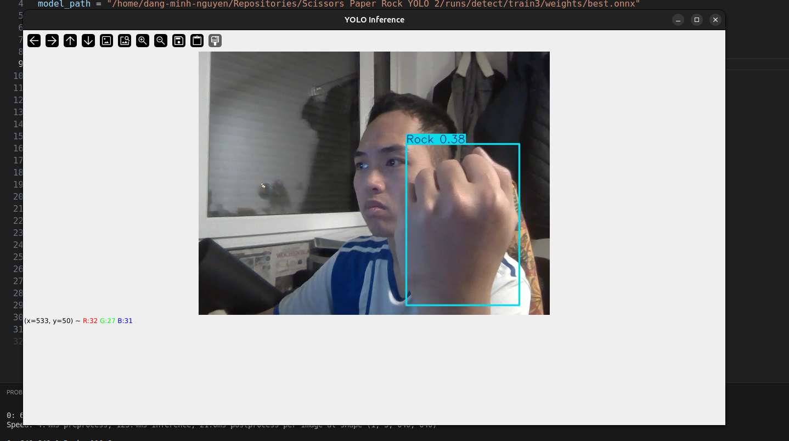
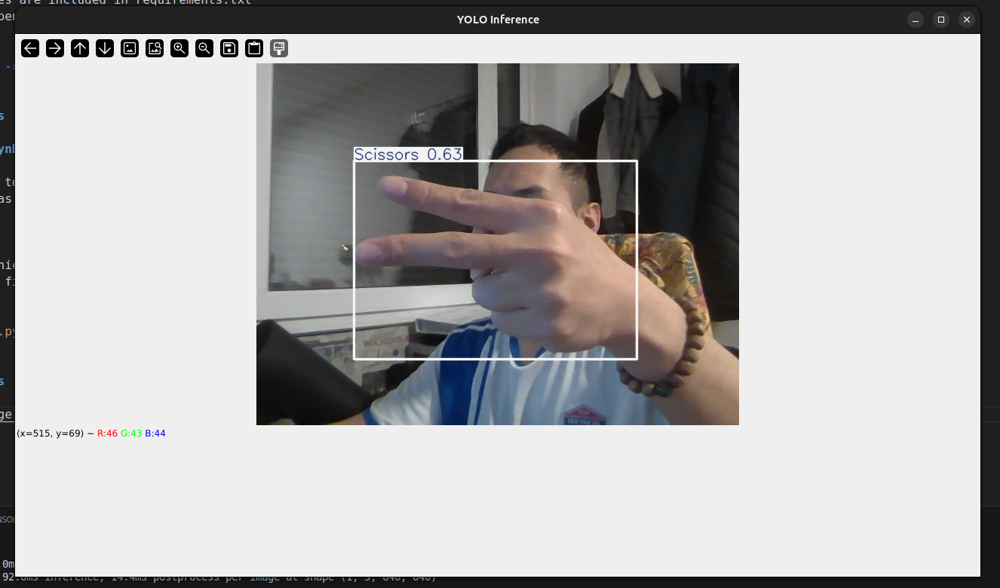
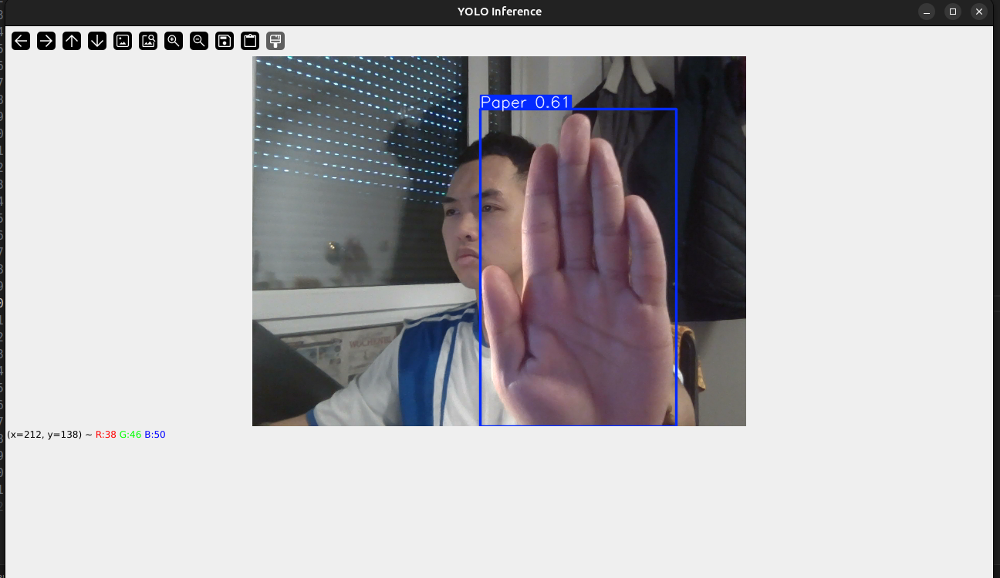

# YOLO Realtime predicts Rcok-Paper-Scissors gesture

## Requirements

- All dependecies are included in requirements.txt
- To install depencies

```bash
    pip install -r requirements.txt
```

- Optional: Uncomment all pip install lines in notebook instead of using requirements.txt

```bash
    %pip install ...
```

## Files Details

### notebook.ipynb

- Notebool file to train YOLO model with custom dataset. which is loaded from roboflox
- Export model as an onnx file to use in python file

### main.py

- Python file which runs webcam and detects gestures using exported YOLO model from notebook
- To run python file:

```bash
    python main.py
```

## Usage

- First, run the notebook to export trained model as best.onnx file
- Secondly, run the main.py

```bash
    python main.py
```

- If you use only the trained model, just run the python file. Run the notebook is not necessary in this case

## Sample Images




